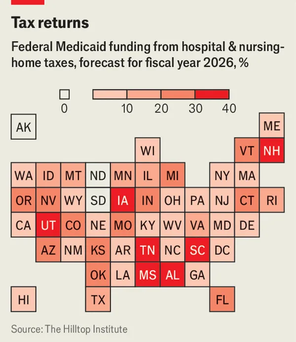
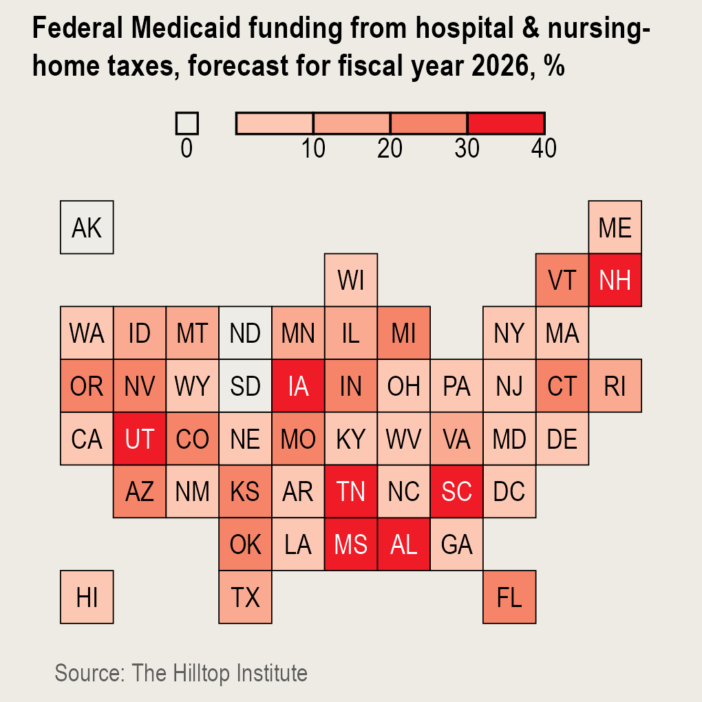

# *The Economist* Data Team's Tile Grid Choropleth Map

Recreating The Economist's U.S. Tile Grid Choropleth Map in {ggplot2}

## Motivation

I'm a huge fan of *The Economist*'s [data team](https://www.economist.com/topics/graphic-detail). They use *The Economist'*s iconic style and design to inform elegant data viz approaches that are extremely flexible, easily translating between print columns, online, and social (especially [Instagram](https://www.instagram.com/theeconomist/)). One of my favorite visualizations is *The Economist* data team's tile grid choropleth map of the 50 states and DC.

### Example

One recent example was featured in the June 26, 2025, issue covering the impacts of the (then yet-to-be-enacted) OBB: [Why America’s hospitals don’t want their taxes cut](https://www.economist.com/united-states/2025/06/26/why-americas-hospitals-dont-want-their-taxes-cut). Among the many great aspects of the visualization:

-   The compact grid shape is easily identifiable, with sensible positioning for the [freak states](https://www.youtube.com/watch?v=V0ApIp1P5Uk) and the District of Columbia.
-   The tiles are labeled by postal abbreviations, making it easy to navigate and make comparisons between states. The labels use appropriate alternating contrasting type color for darker fill (and thus higher percentages).
-   The separate guide legend for `0` values, which could be easily adapted for `NA` values.

{fig-align="center"}

© 2025 The Economist.

### 1. Data

The article draws on data from the [The Hilltop Institute's](https://hilltopinstitute.org/) analysis [What’s the Impact of Eliminating Medicaid Provider Taxes?](https://hilltopinstitute.org/wp-content/uploads/publications/EliminatingProviderTaxes_6May2025.pdf?highlight=Eliminating%20Provider%20Taxes%20May%206%202025) published on May 26, 2025, and available at <https://hilltopinstitute.org/wp-content/uploads/publications/EliminatingProviderTaxes_6May2025.pdf?highlight=Eliminating%20provider>. The report was authored by [Morgan Henderson](mailto:mhenderson@hilltop.umbc.edu), Leigh Goetschius, and Alice Middleton.

### 2. Recreating the Visualization in {ggplot2}

The great {tabulapdf} package made it easy to extracting the data from The Hilltop Institute's report. Although it was (fairly) straightforward to recreate the tile grid, color scheme (using Smart Color Picker), and (generally) the typeface (I *think* Arial Narrow for state names, but not for the title), positioning the scale legends for the "0" values and the guide color bar took some (read a lot of) finessing. The {patchwork} package's `plot_spacer()` function made it possible to approximate the positioning of the original. This approximation can be much improved upon (still using only with the {pathchwork} and {ggplot2} approach).
The great {tabulapdf} package made it easy to extracting the data from The Hilltop Institute's report. Although it was (fairly) straightforward to recreate the tile grid, color scheme (using Smart Color Picker), and (generally) the typeface (I *think* Arial Narrow for state names, but **not** the title), positioning the scale legends for the "0" values and the guide color bar took some (read a lot of) finessing. The {patchwork} package's `plot_spacer()` function made it possible to approximate the location of the original.

### 3. Finessing Final Size

I made an arbitrary decision to make the exported viz a 3.4" square, that loosely approximates the dimensions used by *The Economist* data team.

### 4. Creating a `econ_choropleth()` Function

The final viz is wrapped in the `econ_choropleth()` function, that takes:

-   Data set with numeric values for the 50 states and D.C.

-   palette

-   breaks

-   Source to be credited.

-